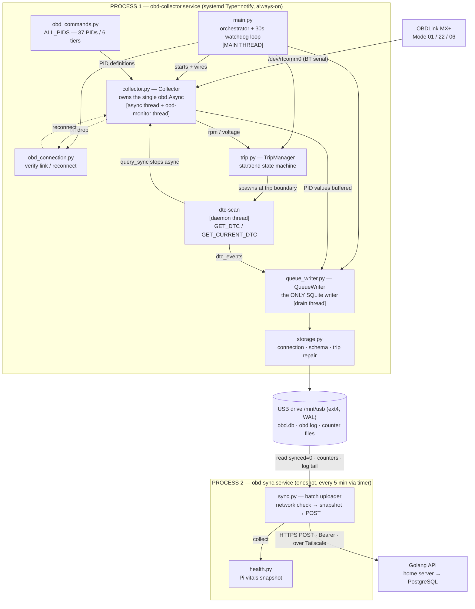

# Pi Module — Component Architecture

How the Python OBD collector is wired together. Two independent processes share
state only through files on the USB drive — they never talk in-memory.

**Cross-cutting (imported almost everywhere, omitted from the flow above):**
`config.py` loads + validates `/etc/obd-collector/config.env` once at import;
`logger.py` is the single `obd-collector` logger — file handler in the collector,
stderr→journald in the sync process (the file handler isn't multi-process safe).

## Threads in the collector process

| Thread | Started by | Job | Liveness guard |
|--------|-----------|-----|----------------|
| **main** | systemd | Boot sequence, then 30s watchdog-ping loop | — (if it stalls, watchdog fires) |
| **python-obd async** | `Collector.start` | Fire PID callbacks ~1Hz; buffer → enqueue; feed TripManager | callback wrapped in try/except so it can't die silently |
| **obd-monitor** | `Collector.start` | Check `is_connected()` every 10s; reconnect on drop | `collector.is_monitor_alive()` |
| **queue-writer drain** | `QueueWriter.start` | Batch-commit rows to SQLite | `queue_writer.is_alive` + `write_failing` |
| **dtc-scan-\*** | `TripManager` (per trip boundary) | Run GET_DTC / GET_CURRENT_DTC, write `dtc_events` | joined by `trip_manager.stop()` |

The main loop exits (and lets systemd restart the service) if the drain thread or
monitor thread dies, or if `write_failing` trips — see `main.py` watchdog loop.

## What each file does

| File | Responsibility | Key types / functions |
|------|----------------|------------------------|
| `main.py` | Process entry point. Boots components in dependency order, runs the watchdog loop, drives the fixed shutdown order. | `main`, `check_rtc`, `_log_heartbeat`, `_handle_sigterm` |
| `config.py` | Loads + validates config from `/etc/obd-collector/config.env` (or env vars) at import. Exits on missing required values. | `Config`, module-level `config` |
| `logger.py` | One shared logger. Collector attaches a rotating USB file handler; sync uses stderr→journald only (file handler isn't multi-process safe). UTC timestamps. | `logger`, `init_file_logging`, `configure_sync_logging` |
| `obd_commands.py` | Single source of truth for every PID: command, table, column, interval. Mode 22 / Mode 06 custom decoders. | `PIDConfig`, `ALL_PIDS`, tier lists, `_mode22`, `_mode06_misfire` |
| `obd_connection.py` | Owns the *verify/reconnect* lifecycle of the BT link and the hard-timeout wrapper that stops python-obd hanging on a stale `rfcomm0`. Persists reconnect count. | `OBDConnection`, `connect_with_timeout` |
| `collector.py` | The data-collection engine. Opens its own `obd.Async`, registers all watchers, buffers per-table combined rows, runs the reconnect monitor, and serialises DTC queries via `query_sync`. | `Collector` |
| `trip.py` | Trip start/end state machine driven by RPM + voltage. Dispatches DTC scans on background threads at each boundary. | `TripManager` |
| `queue_writer.py` | The only writer to SQLite. Thread-safe bounded queue + batched commits under `_db_lock`; surfaces a dead DB via `write_failing`. | `QueueWriter` |
| `storage.py` | DB connection (WAL, integrity check, corrupt-DB quarantine), schema creation, boot-time orphaned-trip repair, trip-number/trip-end helpers. | `get_connection`, `init_schema`, `repair_orphaned_trips`, `update_trip_end`, `get_trip_number` |
| `health.py` | Pi vitals for the health snapshot; reads/writes the persistent counter files that bridge the collector and sync processes. | `collect`, `increment_restart_count`, `read/write_reconnect_count`, `read/write_rtc_ok` |
| `sync.py` | Separate oneshot process. Network check → health snapshot → per-table batched POST to the Golang API in FK-safe priority order. | `run`, `_check_network`, `_write_health_snapshot`, `_sync_table` |

## Key invariants the diagram encodes

- **All SQLite writes funnel through `QueueWriter`** — INSERTs via `enqueue()`, UPDATE/DELETE via `direct_execute()`, reads on the callback thread via `direct_query()`. Nothing else touches `conn` directly (except boot-time `repair_orphaned_trips` and the separate sync process, both single-threaded against their own connection).
- **`Collector` owns the single `obd.Async`**; DTC queries borrow it via `query_sync()` which stops/restarts the loop to avoid a byte race on `rfcomm0`.
- **The two processes share only files**, never memory — hence the counter files (`restart_count`, `reconnect_count`, `rtc_ok`) that let `sync.py` report live collector state.
- **`obd_commands.py` is the only place to add/remove a PID** — `collector.py` registers whatever is in `ALL_PIDS` with no code change.
